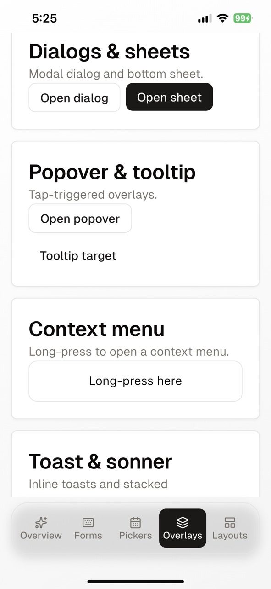
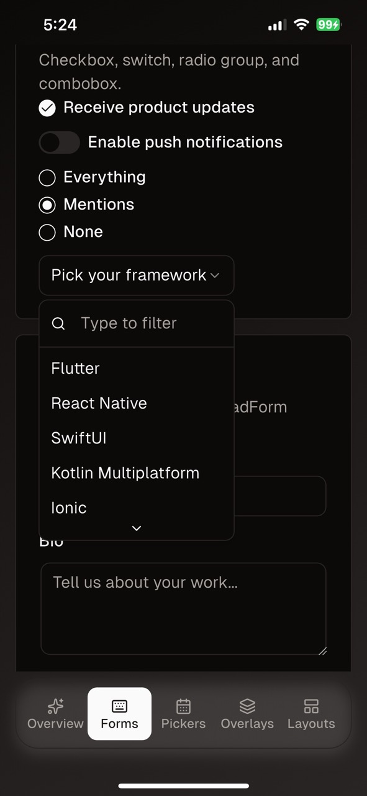
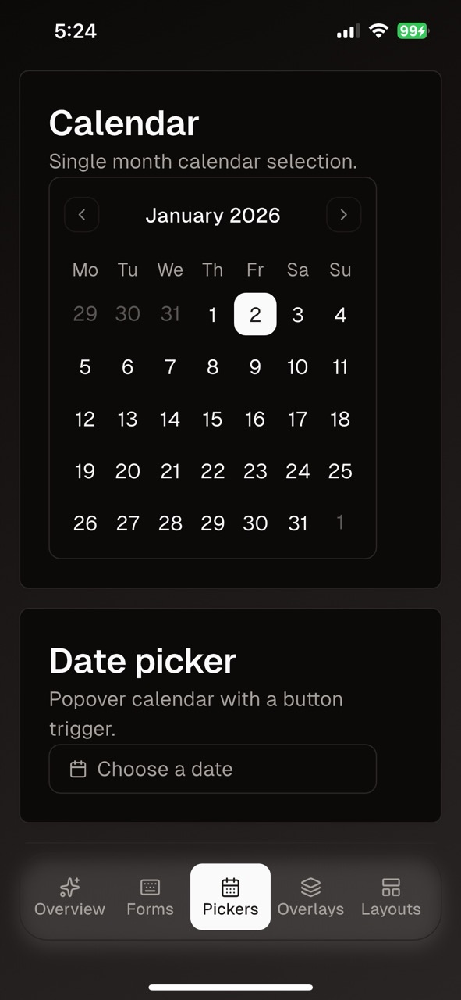
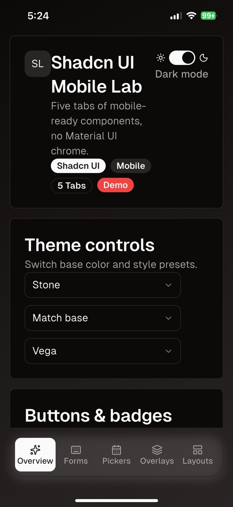
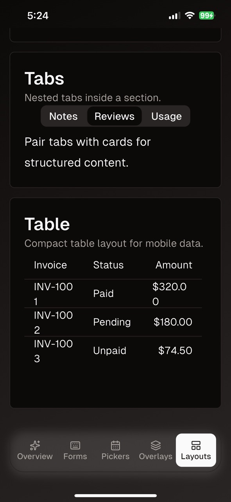

# shadcn-flutter-template

A template for start using shadcn UI library in flutter projects.

## What’s inside

- **A demo app built with `shadcn_ui`**: mobile-friendly UI, no Material “chrome”
- **5 demo tabs**:
  - **Overview**: theme controls (light/dark, base/accent colors, style presets), buttons/badges
  - **Forms**: inputs, textarea, OTP, checkbox/switch/radio/select, validated `ShadForm`
  - **Pickers**: calendar, date picker, time picker, slider + progress
  - **Overlays**: dialogs, bottom sheets, popovers, tooltips, context menu, toast + sonner
  - **Layouts**: accordion, nested tabs, table

## Screenshots

| Overview | Forms |
|---|---|
|  |  |

| Pickers | Overlays |
|---|---|
|  |  |

| Layouts |
|---|
|  |

## Why there are no platform folders in this repo

This repository intentionally **does not commit any platform/deployment folders** (`android/`, `ios/`, `web/`, `windows/`, `macos/`, `linux/`). They can be regenerated locally when needed.

## Getting started

### Prerequisites

- Flutter SDK installed

### Install

```bash
git clone https://github.com/lukeric/shadcn-flutter-template.git
cd shadcn-flutter-template
flutter pub get
```

### Generate platforms (required to run)

Pick the platforms you want, for example Android only:

```bash
flutter create --platforms=android .
```

Or generate multiple:

```bash
flutter create --platforms=android,ios,web,windows,macos,linux .
```

Note: these folders are ignored by default (see [Flutter’s `.gitignore`](https://github.com/flutter/flutter/blob/master/.gitignore)).

### Run

```bash
flutter run
```

## Customize

- **Theme**: see the theme setup in `lib/main.dart` (base colors + accent colors + style presets)
- **Add your screens**: split `lib/main.dart` into `lib/screens/*` and `lib/widgets/*` once you start building your app

## References

- [Flutter `.gitignore`](https://github.com/flutter/flutter/blob/master/.gitignore)
- [Shadcn UI (Flutter) docs](https://flutter-shadcn-ui.mariuti.com/)
- [README template inspiration](https://github.com/Flutterando/flutterando-readme-template)
